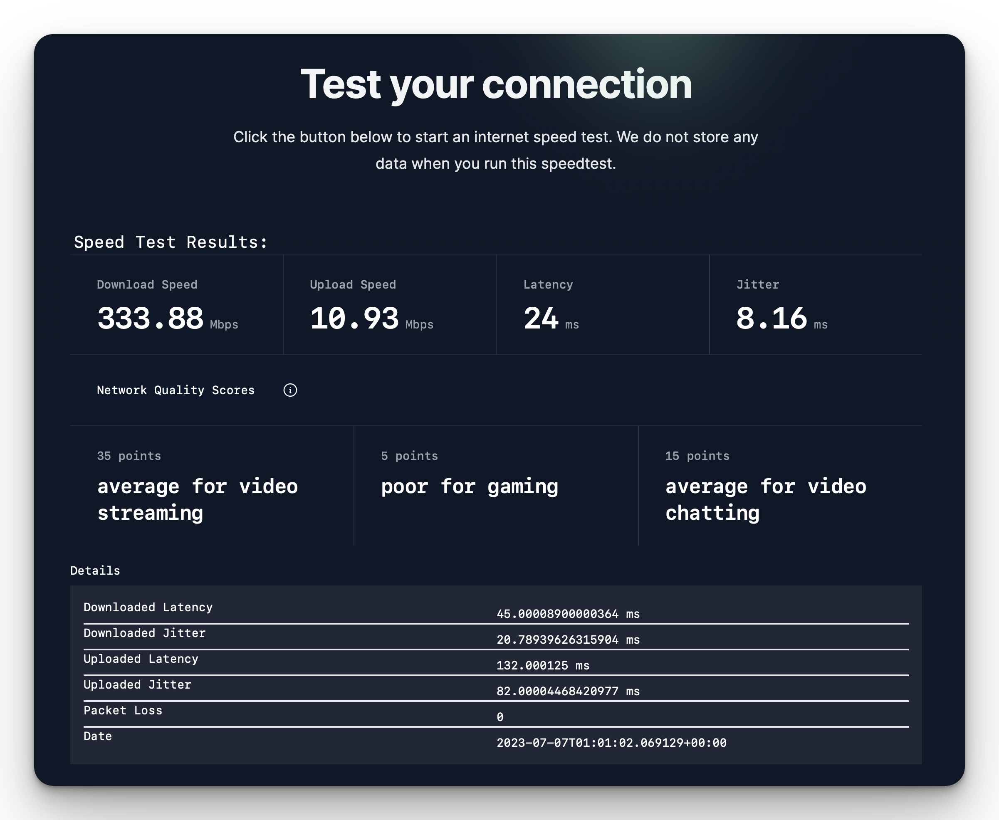

## About



This site was inspired by Digital Equity efforts throughout the State of Hawaii and across the US. For example, [Utah Internet Speed Test](https://business.utah.gov/broadband/speed-test/)

The purpose of this tool:

1. To to provide an easier interface to conduct speed testing surveys "on-the-ground" with Hawaii Residents.
2. Explore broadband access data in Hawaii using Census, FCC, and Ookla speed testing data. We adapted code from The University of Chicago to include demographics relevant to Hawaii (e.g., Native Hawaiian Population). The original dataset can be found in this repo: [https://github.com/internet-equity/internet-access-map](https://github.com/internet-equity/internet-access-map)

No data from the end-user is collected at this time.

## How it works

We utilize [Cloudflare's Speedtest module](https://github.com/cloudflare/speedtest) to measure internet connection. The module implements [PerformanceResourceTiming](https://developer.mozilla.org/en-US/docs/Web/API/PerformanceResourceTiming) to accomplish this.

**This site is experimental: Results may differ from other speed test providers**

## Run locally

To run this on your own hardware:

```bash
git clone https://github.com/jamesthesken/speedtest

cd speedtest
npm install
npm run dev
```

## Learn more:

[https://broadband.hawaii.gov/acp/](https://broadband.hawaii.gov/acp/)

## Get in touch

Email us at `info@kauaitechgroup.com`
